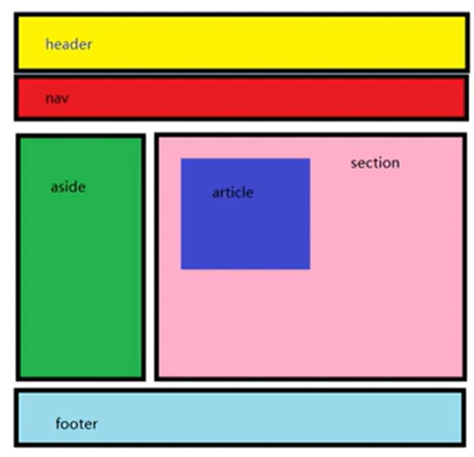
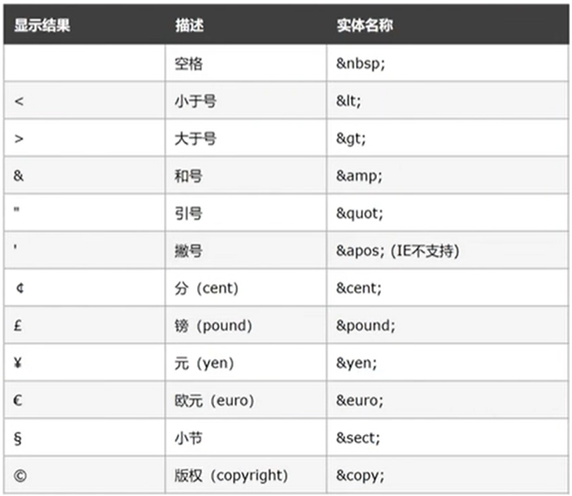

# 前端HMCL学习笔记
记录个人前端HMCL学习笔记

[前端HMCL学习笔记.md](https://raw.githubusercontent.com/Pstarchen/Front-end-HMCL-learning/main/%E5%89%8D%E7%AB%AFHMCL%E5%AD%A6%E4%B9%A0%E7%AC%94%E8%AE%B0.md)

# 表单标签
## input系列
[表单](https://github.com/Pstarchen/Front-end-HMCL-learning/blob/main/%E8%A1%A8%E5%8D%95%E6%A0%87%E7%AD%BE/input%E7%B3%BB%E5%88%97/%E8%A1%A8%E5%8D%95.html)<br>
[表单按钮](https://github.com/Pstarchen/Front-end-HMCL-learning/blob/main/%E8%A1%A8%E5%8D%95%E6%A0%87%E7%AD%BE/input%E7%B3%BB%E5%88%97/%E8%A1%A8%E5%8D%95%E6%8C%89%E9%92%AE.html)<br>
[表格标题和标头](https://github.com/Pstarchen/Front-end-HMCL-learning/blob/main/%E8%A1%A8%E5%8D%95%E6%A0%87%E7%AD%BE/input%E7%B3%BB%E5%88%97/%E8%A1%A8%E6%A0%BC%E6%A0%87%E9%A2%98%E5%92%8C%E8%A1%A8%E5%A4%B4.html)

## select系列
[下拉菜单](https://github.com/Pstarchen/Front-end-HMCL-learning/blob/main/%E8%A1%A8%E5%8D%95%E6%A0%87%E7%AD%BE/select%E7%B3%BB%E5%88%97/%E4%B8%8B%E6%8B%89%E8%8F%9C%E5%8D%95.html)

## textarea系列
[文本域](https://github.com/Pstarchen/Front-end-HMCL-learning/blob/main/%E8%A1%A8%E5%8D%95%E6%A0%87%E7%AD%BE/textarea%E7%B3%BB%E5%88%97/%E6%96%87%E6%9C%AC%E5%9F%9F.html)

## lable系列
[label](https://github.com/Pstarchen/Front-end-HMCL-learning/blob/main/%E8%A1%A8%E5%8D%95%E6%A0%87%E7%AD%BE/label%E7%B3%BB%E5%88%97/label.html)


# 语义化标签
[语义化标签](https://github.com/Pstarchen/Front-end-HMCL-learning/blob/main/%E8%AF%AD%E4%B9%89%E5%8C%96%E6%A0%87%E7%AD%BE/%E8%AF%AD%E4%B9%89%E5%8C%96%E6%A0%87%E7%AD%BE.html)

# 字符实体
[字符实体](https://github.com/Pstarchen/Front-end-HMCL-learning/blob/main/%E5%AD%97%E7%AC%A6%E5%AE%9E%E4%BD%93/%E5%AD%97%E7%AC%A6%E5%AE%9E%E4%BD%93.html)

# 综合示例：
[综合案例1](https://github.com/Pstarchen/Front-end-HMCL-learning/blob/main/%E7%BB%BC%E5%90%88%E6%A1%88%E4%BE%8B1/%E7%BB%BC%E5%90%88%E6%A1%88%E4%BE%8B1.html)<br>
[综合案例2](https://github.com/Pstarchen/Front-end-HMCL-learning/blob/main/%E7%BB%BC%E5%90%88%E6%A1%88%E4%BE%8B2/index.html)<br>
[综合案例3](https://github.com/Pstarchen/Front-end-HMCL-learning/blob/main/%E7%BB%BC%E5%90%88%E6%A1%88%E4%BE%8B3/%E7%BB%BC%E5%90%88%E6%A1%88%E4%BE%8B-%E5%AD%A6%E7%94%9F%E4%BF%A1%E6%81%AF%E6%90%9C%E9%9B%86%E8%A1%A8.html)<br>
[综合案例4](https://github.com/Pstarchen/Front-end-HMCL-learning/tree/main/%E7%BB%BC%E5%90%88%E6%A1%88%E4%BE%8B4)<br>

# 基础认知

## 网页组成

html => 内容

css => 美化

javascript => 互动

## HTML 页面固定结构

```html
<html>
    <head>
        <title>网页的标题</title>
    </head>
    <body>
        网页的主题内容
    </body>
</html>
```

## 开发工具：VS Code

html 骨架自动生成：输入“!”回车

快捷方式：alt+B	用默认浏览器打开网页

## 注释：方便复习

方便想起功能和含义

快捷键：VS Code 中：ctrl+/

```html
<!-- 注释 -->
```

# 标签学习

## html 标签结构

```
<strong>文字加粗</strong>	双标签
开始标签 包裹的内容 结束标签
```

少数标签由一部分组成，叫做单标签

例：

```
<br>换行
<hr>创建一条水平线
```

规律：若需要确定开始位置和结束位置，则是双标签，反之则为单标签

## 标签的关系

父子关系

```html
<head>
    <title></title>
</head>
```

兄弟关系

```html
<head></head>
<body></body>
```

## 标题标签

代码：h 系列标签

```html
<h1>
    1级标题
</h1>
...
<h6>
    2级标题
</h6>
```

语义：1~6 级标题	重要程度依次递减

特点：独占一行

在 body 中输入 `h1` 回车，即可生成 <h1> </h1>

ctrl+D 可选中同一标签内所有选中元素，可同时操作

## 段落标签

场景：在新闻和文章的页面中，用于分段显示

代码：<p> 我是一段文字 </p>

语义：段落

特点：

- 段落间存在间隙
- 独占一行


## 换行标签

场景：让文字强制换行显示

代码：<br>

特点：

- 单标签
- 让文字强制换行

## 水平线标签

场景：分割不同主题内容的水平线

代码：<hr>

特点：

- 单标签
- 在页面中添加一条水平线

# 文本格式化标签

场景：需要让文字 **加粗**、下划线、*倾斜*、删除线等效果

代码：

| 标签 | 说明   |
| ---- | ------ |
| b    | 加粗   |
| u    | 下划线 |
| i    | 倾斜   |
| s    | 删除线 |

| 标签   | 说明   |
| ------ | ------ |
| strong | 加粗   |
| ins    | 下划线 |
| em     | 倾斜   |
| del    | 删除线 |

语义：突出重要性的强调语境，则可以使用后面一组的英文标签

## 文本语义化

根据语义选择对应正确的标签

# 媒体标签

## 图片标签

### 介绍

场景：在网页中显示图片

代码：

特点：

- 单标签
- img 标签需要展示对应的效果，需要借助标签的属性进行设置！

```html
<body>
		# "./"表示当前目录
</body>
```

一个标签可以存在多个属性，属性之间以空格隔开，标签名与属性之间必须以空格隔开。

src 后接图片地址，用来表示图片位置

### 图片标签的 alt 属性

属性名：alt

属性值：替换文本

- 当图片加载失败时，才显示 alt 文本
- 当图片加载成功时，不会显示 alt 文本

```html
<body>
	
</body>
```

### 图片标签的 title 属性

属性名：title

属性值：提示文本

- 当鼠标悬停时，才显示的文本

注意点：title 属性不仅仅可以用于图片标签，还可以用于其他标签

```html
<body>
	
</body>
```

### 图片标签的 width 和 height 属性

属性名：width 和 height

属性值：宽度和高度（数字）

注意点：

- 如果只设置 width 或 height 中的一个，另一个没设置的会自动等比例缩放（图片不会变形）

```html
<body>
	
</body>
```

## 路径

### 介绍

场景：页面需要加载图片，需要先找到对应的图片

路径：绝对路径/相对路径

一般只用相对路径

### 相对路径

当前文件：当前的html网页

目标文件：要找到的图片

同级：“照片.jpg”或“./照片.jpg”

下级：“./images/照片.jpg”或“images/照片.jpg”

#### 上级目录

上级目录：目标文件在上级目录中

代码步骤：

1. 先出当前文件夹，到上一级目录=>../
2. 写目标文件即可

## 音频标签

场景：在页面中插入音频

代码：

```html
<audio src="./music.mp3" controls></audio>
```

常见属性：

| 属性名   | 功能                         |
| -------- | ---------------------------- |
| src      | 音频的路径                   |
| controls | 显示播放的控件               |
| autoplay | 自动播放（部分浏览器不支持） |
| loop     | 循环播放                     |

注意点：音频标签目前支持三种格式：MP3、Wav、Ogg

## 视频标签

场景：在页面中插入视频

代码：

```html
<video src="./video.mp4" controls></video>
```

常见属性：

| 属性名   | 功能                                            |
| -------- | ----------------------------------------------- |
| src      | 视频的路径                                      |
| controls | 显示播放的空间                                  |
| autoplay | 自动播放（谷歌浏览器中需配合muted实现静音播放） |
| loop     | 循环播放                                        |

注意点：视频标签目前支持三种格式：MP4、WebM、Ogg

## 链接标签

### 介绍

场景：点击之后，从一个页面跳转到另一个页面

称呼：a标签、超链接、锚链接

代码：

```html
<a href="./目标网页.html">超链接</a>
```

快捷输入：a+回车

特点：

- 双标签，内部可以包裹内容


### target属性

属性名：target

属性值：目标网页的打开形式

| 取值   | 效果                                   |
| ------ | -------------------------------------- |
| _self  | 默认值，在当前窗口中跳转（覆盖原网页） |
| _blank | 在新窗口跳转（保留原网页）             |

```html
<a href="https://starchen.top" target="_blank">个人主页</a><br>
```

# 列表标签

1. 列表的应用场景
2. 无序列表
3. 有序列表
4. 自定义列表

## 列表的应用场景

场景：在网页中按照行展示关联性的内容，如：新闻列表、排行榜、账单等

特点：按照行的方式，整齐显示内容

种类：无序列表、有序列表、自定义列表

## 无序列表

场景：在网页中表示一组五顺序之分的列表，如：新闻列表

标签组成：

| 标签名 | 说明                                       |
| ------ | ------------------------------------------ |
| ul     | 表示无序列表的整体，用于包裹li标签         |
| li     | 表示无序列表的每一项，用于包含每一行的内容 |

显示特点：

- 列表的每一项前默认显示原点标识

注意点：

- ul标签中只允许包含li标签
- li标签可以包含任意内容

```html
<ul>
	<li>榴莲</li>
	<li>香蕉</li>
	<li>苹果</li>
	<li>哈密瓜</li>
	<li>火龙果</li>
</ul>
```

- 榴莲
- 香蕉
- 苹果
- 哈密瓜
- 火龙果

## 有序列表

场景：在网页中表示一组有顺序之分的列表，如：排行榜。

标签组成：

| 标签名 | 说明                                       |
| ------ | ------------------------------------------ |
| ol     | 表示有序列表的整体，用于包裹li标签         |
| li     | 表示有序列表的每一项，用于包含每一行的内容 |

1. 张三：100分
2. 李四：80分

显示特点：

- 列表的每一项前默认显示序号标识

注意点：

- ol标签中只允许包含li标签
- li标签可以包含任意内容

```html
<ol>
	<li>张三：100分</li>
	<li>李四：80分</li>
</ol>
```

## 自定义列表

场景：在网页的底部导航中通常会使用自定义列表实现。

标签组成：

| 标签名 | 说明                                    |
| ------ | --------------------------------------- |
| dl     | 表示自定义列表的整体，用于包裹dt/dd标签 |
| dt     | 表示自定义列表的主题                    |
| dd     | 表示自定义列表的针对主题的每一项内容    |

显示特点：

- dd前会默认显示缩进效果

注意点：

- dl标签中只允许包含dt/dd标签
- dt/dd标签可以包含任意内容

# 表格标签

## 表格基本标签

场景：在网页中以行+列的单元格的方式整齐展示和数据，如：学生成绩表

基本标签：

| 标签名 | 说明                       |
| ------ | -------------------------- |
| table  | 表格整体，可用于包裹多个tr |
| tr     | 表格每行，可用于包裹td     |
| td     | 表格单元格，可用于包裹内容 |

注意点：

- 标签的嵌套关系：table>tr>td

## 表格相关属性

场景：设置表格基本展示效果

常见相关属性：

| 属性名 | 属性值 | 效果     |
| ------ | ------ | -------- |
| border | 数字   | 边框宽度 |
| width  | 数字   | 表格宽度 |
| height | 数字   | 表格高度 |

注意点：

- 实际开发时针对于样式效果推荐用CSS设置
- 一般不在html中设置宽高

## 表格标题和表头单元格标签

场景：在表格中表示整体大标题和一列小标题

其他标签：

| 标签名  | 名称       | 说明                                                         |
| ------- | ---------- | ------------------------------------------------------------ |
| caption | 表格大标题 | 表示表格整体大标题，默认在表格整体顶部居中位置显示           |
| th      | 表头单元格 | 表示一列小标题，通常用于表格第一行，默认内部文字加粗并居中显示 |

注意点：

- caption标签书写在table标签内部
- th标签书写在tr标签内部（用于替换td标签）

## 表格结构标签（了解）

场景：让表格的内容结构分组，突出表格的不同部分（头部、主题、底部）	

结构标签：

| 标签名 | 名称     |
| ------ | -------- |
| thead  | 表格头部 |
| tbody  | 表格主题 |
| tfoot  | 表格底部 |

注意点：

- 表格结构标签内部用于包裹tr标签
- 表格的结构标签可以省略

## 合并单元格

### 合并单元格-思路

场景：将水平或垂直多个单元格合并成一个单元格

- 跨行合并
- 跨列合并

### 代码实现

合并单元格步骤：

1. 明确合并哪几个单元格
2. 通过左上原则，确定保留谁删除谁
    - 上下合并—>只保留最上的，删除其他
    - 左右合并—>只保留最左的，删除其他
3. 给保留的单元格设置：跨行合并（rowspan）或者跨列合并（colspan）

| 属性名  | 属性值           | 说明                             |
| ------- | ---------------- | -------------------------------- |
| rowspan | 合并单元格的个数 | 跨行合并，将多行的单元格垂直合并 |
| colspan | 合并单元格的个数 | 跨列合并，将多列的单元格水平合并 |

注意点：

- 只有同一个结构标签中的单元格才能合并，不能跨结构标签合并（不能跨：thead、tbody、tfoot）

# 表单标签

1. input系列标签
2. button按钮标签
3. select下拉菜单标签
4. textarea文本域标签
5. label标签

## input系列

场景：在网页中显示收集用户信息的表单效果，如：登录页、注册页

标签名：input

- input标签可以通过type属性值的不同，展示不同效果

type属性值：

| 标签名 | type属性值 | 说明                                     |
| ------ | ---------- | ---------------------------------------- |
| input  | text       | 文本框，用于输入单行文本                 |
| input  | password   | 密码框，用于输入密码                     |
| input  | radio      | 单选框，用于多选一                       |
| input  | checkbox   | 多选框，用于多选多                       |
| input  | file       | 文本选择，用于之后上传文件               |
| input  | submit     | 提交按钮，用于提交                       |
| input  | reset      | 重置按钮，用于重置                       |
| input  | button     | 普通按钮，默认无功能，之后配合js添加功能 |

### 文本框

场景：在网页中显示输入单行文本的表单空间

type属性值：text

常用属性：

| 属性名      | 说明                           |
| ----------- | ------------------------------ |
| placeholder | 占位符。提示用户输入内容的文本 |

### 单选框

场景：在网页中显示多选一的单选表单控件

type属性值：radio

常用属性：

| 属性名  | 说明                                                         |
| ------- | ------------------------------------------------------------ |
| name    | 分组。有相同name属性值的单选框为一组，一组中同时只能有一个被选中 |
| checked | 默认选中                                                     |

注意点：

- name属性对于单选框有分组功能
- 有相同name属性值的单选框为一组，一组中只能同时有一个被选中

### 文件选择

场景：在网页中显示文件选择的表单控件

type属性值：file

常用属性：

| 属性名   |            |
| -------- | ---------- |
| multiple | 多文件选择 |

### input标签

场景：在网页中显示用户点击的按钮

标签名：input

type属性值：

| 标签名 | type属性 | 说明                                     |
| ------ | -------- | ---------------------------------------- |
| input  | submit   | 提交按钮。点击之后提交数据给后端服务器   |
| input  | reset    | 重置按钮。点击之后恢复表单默认值         |
| input  | button   | 普通按钮。默认无功能，之后配合js添加功能 |

```html
<form action="">
</form>
```

表单域标签form，将内容写在表单域内，才可以和里面的所有功能相联系。

### 按钮标签

场景：在网页中显示用户点击的按钮

标签名：button

type属性值（同input的按钮系列）：

| 标签名 | type属性 | 说明                                     |
| ------ | -------- | ---------------------------------------- |
| input  | submit   | 提交按钮。点击之后提交数据给后端服务器   |
| input  | reset    | 重置按钮。点击之后恢复表单默认值         |
| input  | button   | 普通按钮。默认无功能，之后配合js添加功能 |

注意点：

- 谷歌浏览器中button默认是提交按钮
- button标签是双标签，更便于包裹其他内容：文字、图片等

可以把button作为标签出现

## select系列

### select下拉菜单标签

场景：在网页中提供多个选择性的下拉菜单表单控件

标签组成：

- select标签：下拉菜单的整体
- option标签：下拉菜单的每一项

常见属性：

- selected：下拉菜单的默认选择

## textarea文本域标签

场景：在网页中提供可输入多行文本的表单控件

标签名：textarea

常见属性：

- cols：规定了文本域内可见宽度
- rows：规定了文本域内可见行数

注意点：

- 右下角可以拖拽改变大小
- 实际开发时针对于样式效果推荐用CSS设置

## label标签

场景：常用于绑定内容与表单标签的关系

标签名：label

使用方法①：

1. 使用label标签把内容（如文本）包裹起来
2. 在表单标签上添加id属性
3. 在label标签的for属性中设置对应的id属性值

使用方法②：

1. 直接使用label标签把内容（如文本）和表单标签一起包裹起来
2. 需要把label标签的for属性删除即可

附：alt+shift+⬇即可复制同一行代码带下一段

# 语义化标签

没有语义布局标签（div、span）和有语义的布局标签

## div和span

场景：实际开发网页时会大量频繁的使用到div和span

特点：

- div独占一行
- span不会独占一行

## 有语义的布局标签

标签：

| 标签名  | 语义       |
| ------- | ---------- |
| header  | 网页头部   |
| nav     | 网页导航   |
| footer  | 网页底部   |
| aside   | 网页侧边栏 |
| section | 网页区块   |
| article | 网页文章   |

注意点：

- 以上标签显示特点和div一致，但是比div多了不同的语义



# 字符实体

通过字符实体在网页中显示特殊符号

学习路径：

1. HTML中的空格合并现象
2. 常见字符实体

## 常见字符实体


